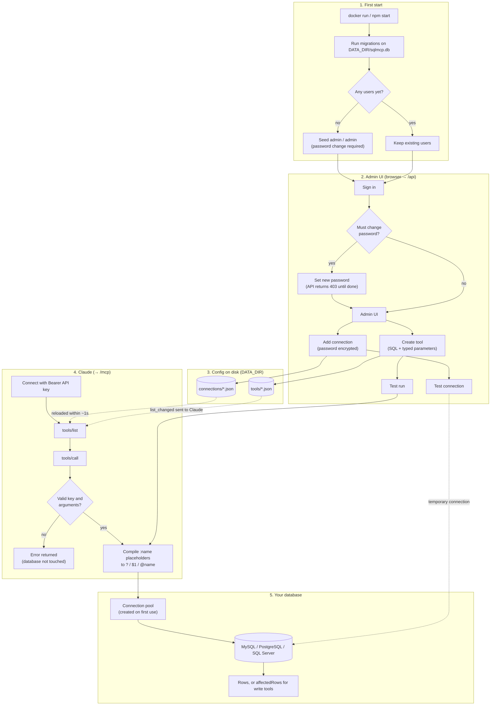
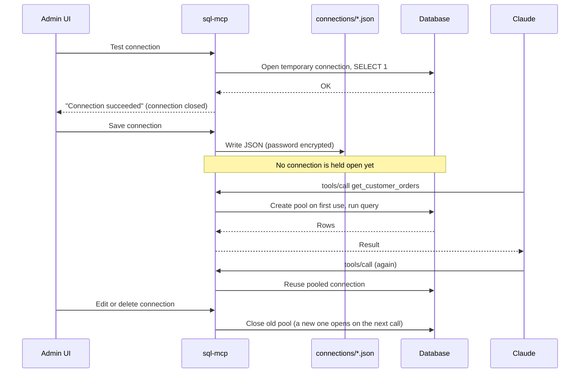

# SQL MCP

A self-hosted [MCP](https://modelcontextprotocol.io) server that turns **SQL queries you define** into tools Claude can call.
Works with **MySQL / MariaDB**, **PostgreSQL** and **Microsoft SQL Server**.

- Define each tool as JSON: the query, its typed parameters, and a description for Claude
- Manage connections and tools in a web admin UI, or edit the JSON files directly (changes reload automatically)
- Values are always sent as bound parameters, never pasted into SQL
- Per-tool **read-only** or **read-write** mode
- One Docker image, API-key auth, Streamable HTTP transport

```
Claude ──HTTPS + API key──►  /mcp   ─┐
You    ──browser + login ──►  /      ├─ sql-mcp ──► MySQL / PostgreSQL / SQL Server
                              /api  ─┘      │
                                     /data/{connections,tools}/*.json
                                     /data/sqlmcp.db (admin users)
```

## How it works

### Full workflow

From first start, through setting up connections and tools in the admin UI, to Claude calling a tool:



### When is the database connection opened?

Saving a connection in the UI only writes a JSON file. The real connection is opened when it's first needed:



- Read tools run in a read-only transaction (MySQL, PostgreSQL). On SQL Server they run in a transaction that is always rolled back.
- A test run in the UI goes through exactly the same path as a call from Claude.
- On restart, pools are recreated lazily. Nothing connects to your databases until a tool is used.

## Quick start (Docker)

```bash
docker run -d --name sql-mcp -p 3000:3000 \
  -v sqlmcp-data:/data \
  -e API_KEY="$(openssl rand -hex 32)" \
  -e SECRET_KEY="$(openssl rand -hex 32)" \
  ghcr.io/devimfaheem/relationaldb-mcp:latest
```

Open http://localhost:3000 and sign in with **`admin` / `admin`**. You'll be asked to choose a new password straight away.
Then add a connection and create a tool.
Run `docker exec sql-mcp printenv API_KEY` to get the key Claude will use.

> The image is published when a `v*` tag is pushed. You can also build it yourself: `docker build -t relationaldb-mcp .`

### Try the demo stack

The repo includes a compose file with sample MySQL and PostgreSQL databases (and optionally SQL Server) plus example tools:

```bash
git clone https://github.com/devimfaheem/relationaldb-mcp.git && cd relationaldb-mcp
cp .env.example .env        # fill in API_KEY and SECRET_KEY
docker compose up --build   # add --profile mssql to include SQL Server
```

## Connect Claude

The MCP endpoint is `https://your-host/mcp`. Clients authenticate with `Authorization: Bearer <API_KEY>`.

**Claude Code**

```bash
claude mcp add --transport http sql https://your-host/mcp --header "Authorization: Bearer YOUR_API_KEY"
```

**Claude Desktop** (`claude_desktop_config.json`, using [`mcp-remote`](https://www.npmjs.com/package/mcp-remote))

```json
{
  "mcpServers": {
    "sql": {
      "command": "npx",
      "args": ["-y", "mcp-remote", "https://your-host/mcp", "--header", "Authorization:${AUTH_HEADER}"],
      "env": { "AUTH_HEADER": "Bearer YOUR_API_KEY" }
    }
  }
}
```

**claude.ai custom connectors** can't send custom headers. Set `ALLOW_QUERY_KEY=true` and use
`https://your-host/mcp?key=YOUR_API_KEY` as the connector URL. The key is then part of the URL and can end up in
proxy and access logs, so only do this over HTTPS and rotate the key if it leaks.

## Defining tools

Each tool is a file at `/data/tools/<name>.json`, and each connection is a file at `/data/connections/<id>.json`.
The admin UI writes these files for you. You can also create or edit them by hand, or keep them in git.

### Tool

```json
{
  "name": "get_customer_orders",
  "description": "Returns a customer's orders, newest first. Optionally filter by status.",
  "connection": "sales_db",
  "mode": "read",
  "enabled": true,
  "query": "SELECT id, total, status FROM orders WHERE customer_id = :customer_id AND (:status IS NULL OR status = :status) ORDER BY created_at DESC LIMIT :limit",
  "parameters": [
    { "name": "customer_id", "type": "integer", "required": true, "description": "Customer ID" },
    { "name": "status", "type": "string", "enum": ["pending", "shipped", "cancelled"], "description": "Filter by status" },
    { "name": "limit", "type": "integer", "default": 50, "min": 1, "max": 500, "description": "Max rows" }
  ],
  "limits": { "maxRows": 500, "timeoutMs": 15000 }
}
```

| Field | Required | Notes |
|---|---|---|
| `name` | yes | Lowercase letters, digits and `_`, starting with a letter. Must match the file name. |
| `description` | yes | Shown to Claude. Say what the tool returns and when to use it. |
| `connection` | yes | The `id` of a connection. |
| `mode` | yes | `read` runs in a read-only transaction. `write` commits and returns `affectedRows`. |
| `enabled` | no | Default `true`. Disabled tools are hidden from Claude. |
| `query` | yes | SQL with `:name` placeholders. A placeholder can appear more than once. |
| `parameters` | no | See below. Every placeholder needs a parameter, and every parameter must be used in the query. |
| `limits.maxRows` | no | Default 1000 (max 10000). Results beyond this are cut off and flagged `truncated`. |
| `limits.timeoutMs` | no | Default 30000. |

**Parameters:** `name`, `type` (`string`, `integer`, `number`, `boolean`, `date`, `datetime`), `description`, and optionally
`required`, `default`, `enum`, `min`/`max` (numbers), `pattern`/`maxLength` (strings). An optional parameter that isn't
supplied and has no default is bound as `NULL`, which makes `(:x IS NULL OR col = :x)` filters work.

Placeholders are converted to each engine's native parameters (`?` for MySQL, `$1` for PostgreSQL, `@name` for SQL Server).
`::` casts, string literals, quoted identifiers and comments are left alone.

> **PostgreSQL tip:** when an optional parameter is only compared with `IS NULL`, PostgreSQL can't infer its type.
> Add a cast, for example `:country::text IS NULL`.

### Connection

```json
{
  "id": "sales_db",
  "engine": "postgres",
  "host": "db.example.com",
  "port": 5432,
  "database": "sales",
  "user": "readonly_user",
  "password": "${SALES_DB_PASSWORD}",
  "ssl": { "enabled": true, "rejectUnauthorized": true },
  "pool": { "max": 10 },
  "options": {}
}
```

- `engine`: `mysql` (also covers MariaDB), `postgres` or `mssql`. The default ports are 3306, 5432 and 1433.
- `password` can be:
  - an encrypted `enc:v1:…` value (the UI encrypts passwords with `SECRET_KEY`)
  - a `${ENV_VAR}` reference, resolved from the container's environment
  - plain text (not recommended)
- `user` also accepts `${ENV_VAR}`.
- `options` is passed through to the driver. For SQL Server, for example: `{ "instanceName": "SQLEXPRESS" }`.

## Configuration

| Variable | Required | Default | |
|---|---|---|---|
| `API_KEY` | yes | | Key Claude uses to call `/mcp`. At least 32 characters. |
| `SECRET_KEY` | yes | | Encrypts stored passwords and signs sessions. At least 32 characters. **If you change it, stored passwords can no longer be decrypted.** |
| `PORT` | | `3000` | |
| `DATA_DIR` | | `/data` | Where connection and tool JSON files and the `sqlmcp.db` app database live. |
| `ALLOW_QUERY_KEY` | | `false` | Accept the key as `?key=`, for claude.ai connectors. |
| `TRUST_PROXY` | | `false` | Set to `true` behind a TLS-terminating reverse proxy. |
| `LOG_LEVEL` | | `info` | |

## Admin login and the app database

On first start the server creates `DATA_DIR/sqlmcp.db`, a small SQLite database for admin users, and runs its migrations
(`src/server/migrations.ts`). The first migration creates the `users` table, and the second seeds an **`admin` / `admin`**
login that must be changed before anything else can be done in the UI. Migrations are tracked in a `schema_migrations`
table, so restarts never re-seed or overwrite your password.

Forgot the password? Reset it to `admin` / `admin` (you'll be asked to change it again on next sign-in):

```bash
docker exec sql-mcp node dist/server/reset-admin.js      # Docker
npm run reset-admin                                      # from source (uses DATA_DIR)
```

Back up `/data` to keep your tools, connections and login.

## Security

- **Use a least-privilege database user.** For read-only tools, give the user `SELECT` only.
- Read-only mode is enforced with `START TRANSACTION READ ONLY` (MySQL) and `BEGIN READ ONLY` (PostgreSQL).
  SQL Server has no read-only transaction mode, so read tools run in a transaction that is **always rolled back**.
  A read-only login is still recommended.
- Claude can only run the queries you define. There is no "run arbitrary SQL" tool.
- Put the server behind HTTPS, for example with Caddy: `caddy reverse-proxy --from your-host --to localhost:3000`.
  Also set `TRUST_PROXY=true`.
- Failed API key and login attempts are rate-limited per IP.
- When mounting a host directory as `/data` on Linux, make sure it's writable by UID 1000, which is the container's `node` user.

## Development

```bash
npm install
cp .env.example .env            # set DATA_DIR=./data for local runs
npm run build && node --env-file=.env --disable-warning=ExperimentalWarning dist/server/index.js
npm run dev:ui                  # UI with hot reload on :5173 (proxies /api to :3000)
npm test
```

Project layout: `src/shared` holds the JSON schemas and placeholder compiler, `src/server` the Fastify server, MCP,
admin API and drivers, and `ui/` the React admin UI.

## License

MIT
